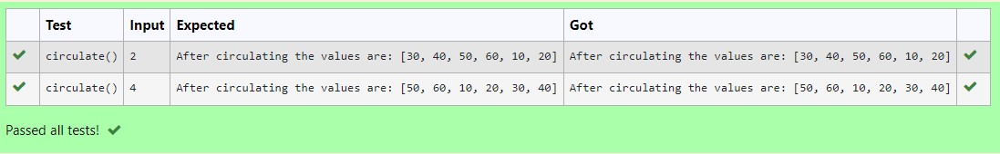

# Circulate-the-values-of-N-variables
## Aim:
To write a python program to circulate the n variables using function concept
## Equipment’s required:
PC
Anaconda - Python 3.7
## Algorithm: 
### Step 1:
 start
### Step 2: 
get the input from the user
### Step 3: 
Get the value from the user for the number of rotation
### Step 4: 
Using the slicing concept rotate the list

### Step 5:
 using the step4 we can circulates the numbers
### Step 6: 
stop
## Program:
~~~ python

def circulate():
    l=[10,20,30,40,50,60]

    n=int(input(""))
    l=l[n:]+l[:n]
    print("After circulating the values are:",l)
~~~

## Output:

## Result:
thus the python program run successfully